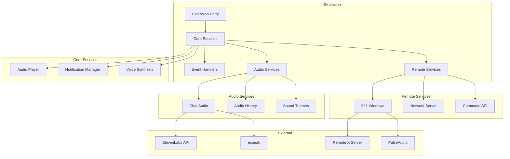
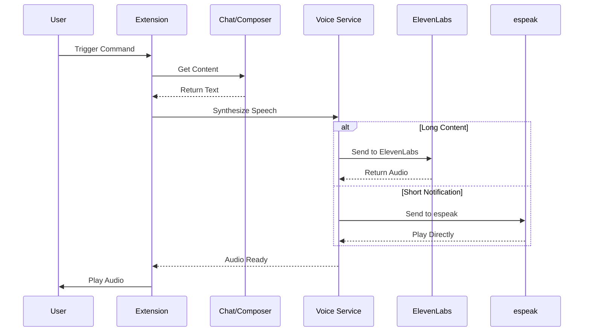
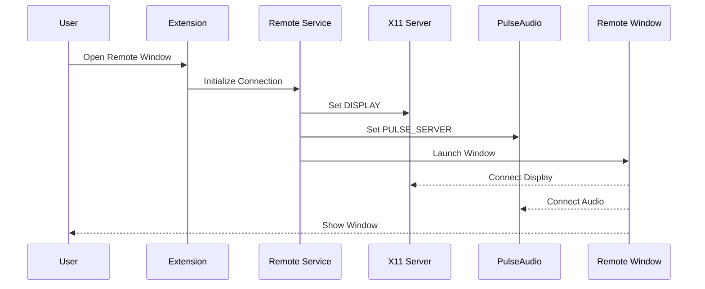
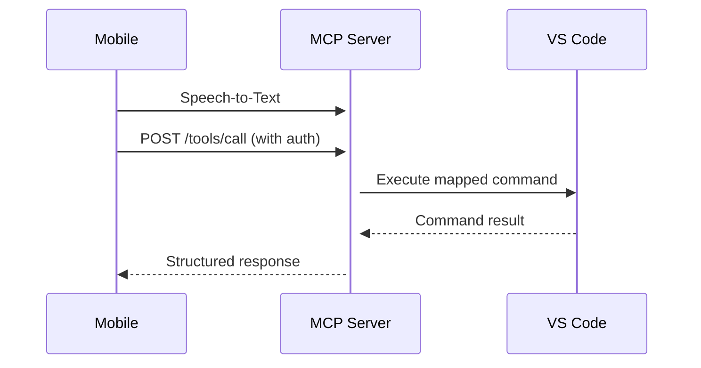

# Cursor Audio Notifications

A VS Code/Cursor extension that provides interactive audio notifications with voice synthesis and remote capabilities.

## Features

- 🔊 Audio notifications for IDE events
- 🗣️ Voice synthesis with ElevenLabs and espeak
- 🌐 Remote X11 window support
- 🔄 Command sequences automation
- 📝 Chat response audio playback
- 📜 Audio history management
- 🌍 Network command access

## Architecture



## Voice Synthesis Flow



## Remote Operation Flow



## Installation

1. Install the extension from the VS Code/Cursor marketplace
2. Configure your settings:
   ```json
   {
     "audioNotifications.voiceSynthesis": "elevenlabs",
     "audioNotifications.elevenLabsApiKey": "your-api-key",
     "audioNotifications.remoteSettings": {
       "x11Display": ":0",
       "pulseServer": "tcp:localhost:4713"
     }
   }
   ```
3. Reload your editor

## Configuration

### Voice Synthesis
- `audioNotifications.voiceSynthesis`: Voice provider (`"none"`, `"elevenlabs"`, `"espeak"`)
- `audioNotifications.elevenLabsApiKey`: Your ElevenLabs API key
- `audioNotifications.volume`: Volume level (0-100)
- `audioNotifications.chatAudioEnabled`: Auto-convert chat responses
- `audioNotifications.chatAudioLanguage`: Audio language (`"en"`, `"cs"`)
- `audioNotifications.maxAudioLength`: Max sentences per conversion

### Remote Settings
- `audioNotifications.remoteSettings`: X11 and audio forwarding
  - `x11Display`: X server display
  - `pulseServer`: PulseAudio server
  - `sshHost`: Remote host
  - `sshUser`: SSH username
  - `sshPort`: SSH port

### Network Access
- `audioNotifications.networkServer`: Remote command access
  - `enabled`: Enable network server
  - `port`: Server port
  - `host`: Server host
  - `authToken`: Authentication token

## Commands

### Audio Controls
- `Audio Notifications: Play Test Sound` - Test notification sounds
- `Audio Notifications: Toggle Sound` - Enable/disable sounds
- `Audio Notifications: Test Voice Synthesis` - Test TTS
- `Audio Notifications: Toggle Chat Audio` - Toggle chat TTS
- `Audio Notifications: Play Last Chat Response` - Play last response

### Remote Operations
- `Audio Notifications: Open Remote Composer` - Open remote composer
- `Audio Notifications: Open Remote Chat` - Open remote chat
- `Audio Notifications: Start Network Server` - Start command server

### Utility Commands
- `Audio Notifications: Show Audio History` - View audio history
- `Audio Notifications: Copy Last Response` - Copy response text
- `Audio Notifications: Copy Modified Files` - Copy changed files
- `Audio Notifications: Run Composer Sequence` - Run command sequence

## Voice Synthesis Details

### ElevenLabs Integration
- High-quality TTS for long-form content
- Multiple voice options
- Language support
- Style customization
- Response caching

### espeak Usage
- Quick notifications
- Status updates
- System messages
- Offline operation

## Remote Operation Details

### X11 Forwarding
- Display remote windows locally
- Audio forwarding via PulseAudio
- Secure SSH tunneling
- Environment variable handling

### Network Access
- Remote command execution
- Authentication required
- Configurable endpoints
- Command API access

## Mobile Integration

### MCP Tool Interface
The extension implements the Model Context Protocol (MCP) for mobile control:



### Voice Command Mapping
Voice commands are mapped to tool arguments using the following structure:

| Voice Command | Tool | Arguments |
|--------------|------|-----------|
| "Move up/down/left/right" | cursor_control | `{ command: "move", args: { direction: "up/down/left/right" }}` |
| "Type [text]" | cursor_control | `{ command: "insert", args: { text: "[text]" }}` |
| "Run command [name]" | cursor_control | `{ command: "execute", args: { commandId: "[name]" }}` |
| "Scroll up/down" | cursor_control | `{ command: "scroll", args: { direction: "up/down" }}` |
| "Open file [path]" | cursor_control | `{ command: "open", args: { filePath: "[path]" }}` |
| "Terminal [command]" | cursor_control | `{ command: "terminal", args: { shellCommand: "[command]" }}` |

### Mobile App Integration
To integrate with the mobile app:

1. **Server Discovery**
   - Uses mDNS/Bonjour for local network discovery
   - Default port: 3000 (configurable)
   - Secure API key exchange via QR code

2. **Authentication**
   - API key required for all requests
   - QR code contains server URL and API key
   - Keys are regenerated on server restart

3. **Voice Processing**
   - Mobile app handles speech-to-text
   - Converts natural language to structured commands
   - Supports command chaining and context

4. **Error Handling**
   - Network connectivity issues
   - Invalid commands
   - Authentication failures
   - Command execution errors

### Mobile Configuration
Configure mobile integration in settings:

```json
{
  "audioNotifications.networkServer": {
    "enabled": true,
    "port": 3000,
    "host": "0.0.0.0",
    "mdns": true
  },
  "audioNotifications.mobile": {
    "allowedCommands": ["move", "insert", "execute", "scroll", "open", "terminal"],
    "voiceLanguage": "en-US",
    "commandTimeout": 5000
  }
}
```

## Requirements

- VS Code ^1.85.0 or Cursor IDE
- Node.js for audio playback
- X11 server for remote windows
- PulseAudio for remote audio
- SSH for remote access

## Known Issues

Please report issues on the [GitHub repository](https://github.com/sparesparrow/cursor-audio-notifications/issues).

## Release Notes

### 1.0.0

Initial release of Cursor Audio Notifications:
- Basic audio notification system
- Build completion notifications
- Debug session notifications
- File save notifications
- Configuration options

## Contributing

Contributions are welcome! Please feel free to submit a Pull Request.

## License

This project is licensed under the MIT License.

## Support

- File issues on GitHub
- Contact: your.email@example.com

## Acknowledgments

- Cursor IDE team
- VSCode extension API
- ElevenLabs API
- espeak project
- play-sound package 