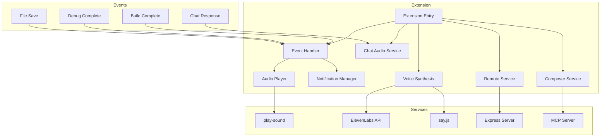
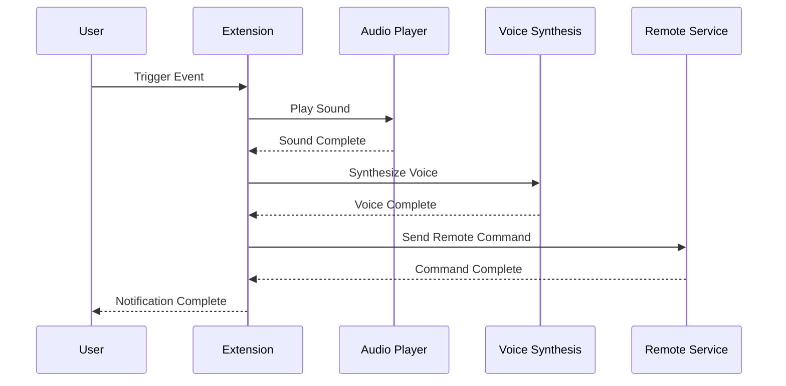
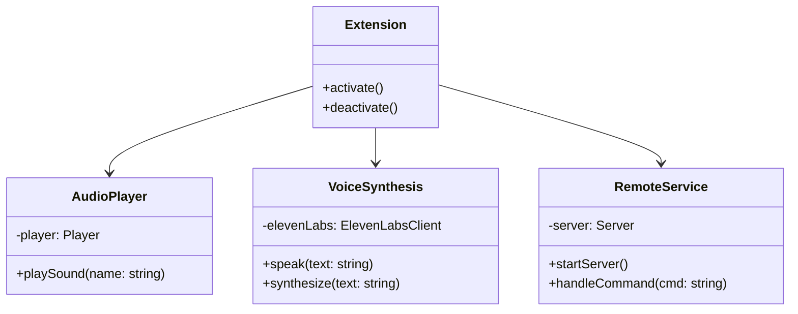
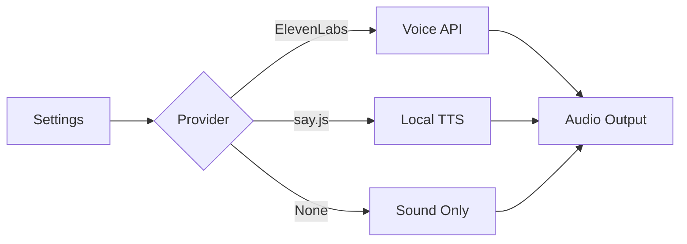

# Audio Notifications Architecture

## System Overview

```mermaid
graph TB
    subgraph Extension
        A[Extension Entry] --> B[Event Handler]
        B --> C[Audio Player]
        B --> D[Notification Manager]
        A --> E[Voice Synthesis]
        A --> F[Chat Audio Service]
        A --> G[Remote Service]
        A --> H[Composer Service]
    end
    
    subgraph Services
        C --> I[play-sound]
        E --> J[ElevenLabs API]
        E --> K[say.js]
        G --> L[Express Server]
        H --> M[MCP Server]
    end
    
    subgraph Events
        N[Build Complete] --> B
        O[Debug Complete] --> B
        P[File Save] --> B
        Q[Chat Response] --> F
    end
```

## Service Flow

```mermaid
sequenceDiagram
    participant U as User
    participant E as Extension
    participant A as Audio Player
    participant V as Voice Synthesis
    participant R as Remote Service

    U->>E: Trigger Event
    E->>A: Play Sound
    A-->>E: Sound Complete
    E->>V: Synthesize Voice
    V-->>E: Voice Complete
    E->>R: Send Remote Command
    R-->>E: Command Complete
    E-->>U: Notification Complete
```

## Component Structure

```mermaid
classDiagram
    class Extension {
        +activate()
        +deactivate()
    }
    
    class AudioPlayer {
        -player: Player
        +playSound(name: string)
    }
    
    class VoiceSynthesis {
        -elevenLabs: ElevenLabsClient
        +speak(text: string)
        +synthesize(text: string)
    }
    
    class RemoteService {
        -server: Server
        +startServer()
        +handleCommand(cmd: string)
    }
    
    Extension --> AudioPlayer
    Extension --> VoiceSynthesis
    Extension --> RemoteService
```

## Configuration Flow

```mermaid
flowchart LR
    A[Settings] --> B{Provider}
    B -->|ElevenLabs| C[Voice API]
    B -->|say.js| D[Local TTS]
    B -->|None| E[Sound Only]
    C --> F[Audio Output]
    D --> F
    E --> F
``` 